## Streamline IBM Guardium Data Protection Functionalities : Enhancing Guardium User Experience and Efficiency

In the ever-evolving landscape of data security and protection, seamless access to functionalities is key to ensuring efficiency and ease of use. The integration of IBM watsonx Assistant and Guardium Data Protection (GDP) offers a transformative way for users to manage data security through a conversational interface, eliminating the need to navigate the GDP console. Whether you're an IT Security Analyst, Compliance Officer, or Data Protection Manager, this integration provides seamless access to critical functionalities, streamlining tasks like report generation, data protection management, and policy enforcement. The use of watsonx.ai further enhances this experience by summarizing reports, offering quick insights to make informed decisions, and ensuring operational efficiency.

For leadership roles such as CIOs and CTOs, this integration marks a significant step toward future-proofing data protection strategies. As an MVP, it showcases the potential of watsonx to drive efficiency through AI-driven automation, with smarter tools designed to meet the evolving demands of data security. This streamlined, intuitive approach empowers teams to manage security more effectively while minimizing risks and enhancing the overall user experience.

This repo contains two main folder.

    1. guardium-combine-functionalities contains the function which has all the guardium functionalities.
    2. guardium-report-summarization which has all the function generating the report summary and sending the summary in email

    For sending email you need to configure the app on google cloud console which will generate the credentails. Copy the credentials and create credentials.json file. Also update the relevant emaqils id in sender in app.py file.

    In this folder, index.html and Password-example-action.json file is for masking the password input.

## Importing Custom Extensions in Watsonx Assistant
    1. Log in to your Watsonx Assistant instance.**
    2. Navigate to the Integration section located at the bottom left corner.

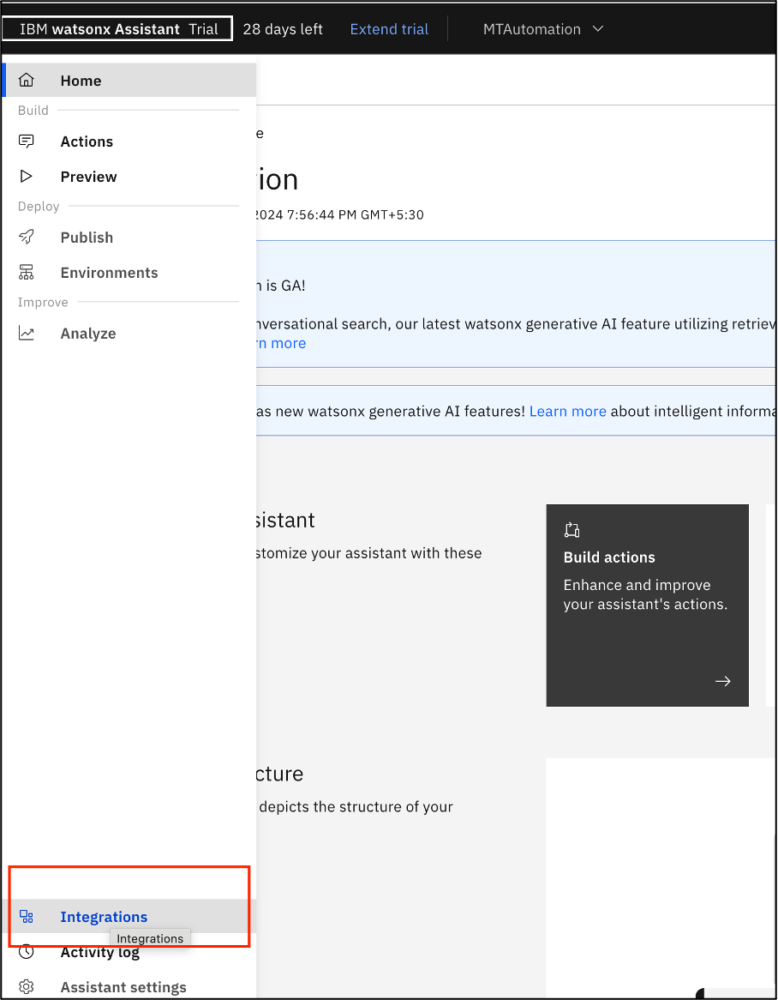

    3. Select "Build custom extension" from the Extensions section.

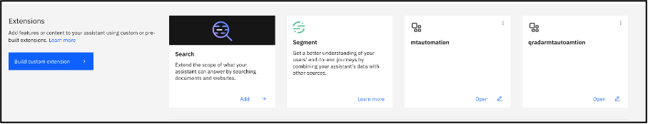

    4. Click "Next" to proceed.

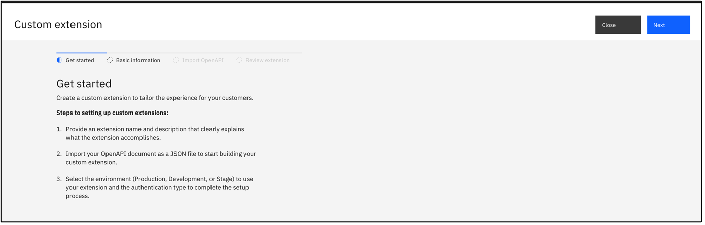

    5. Enter a name for your extension and provide a description if desired.

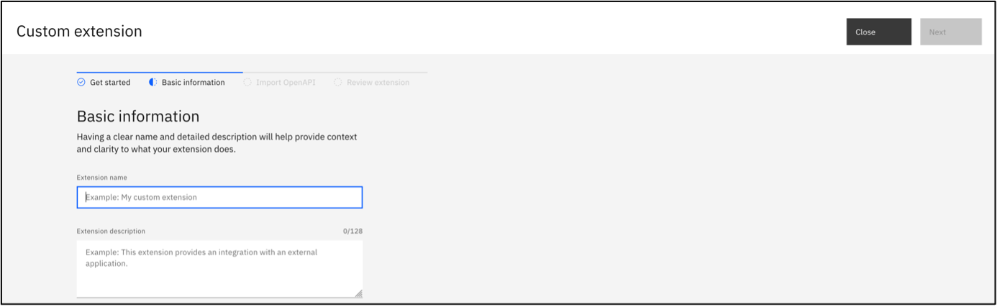

    6. Click "Next" to continue.
    7. In the Import OpenAPI section, click on "Drag and drop file here" or "Click to upload."

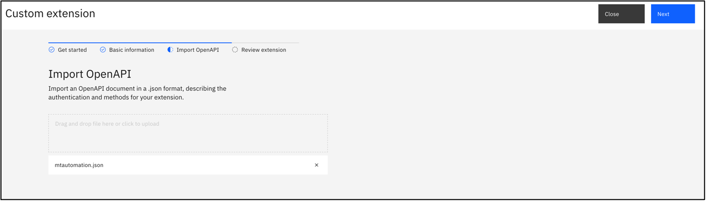

    8. Upload the reportsummary-openapi.json file you downloaded from GitHub.
    9. Click "Next" 
    10. On the Review page, verify your extension details and click "Finish."

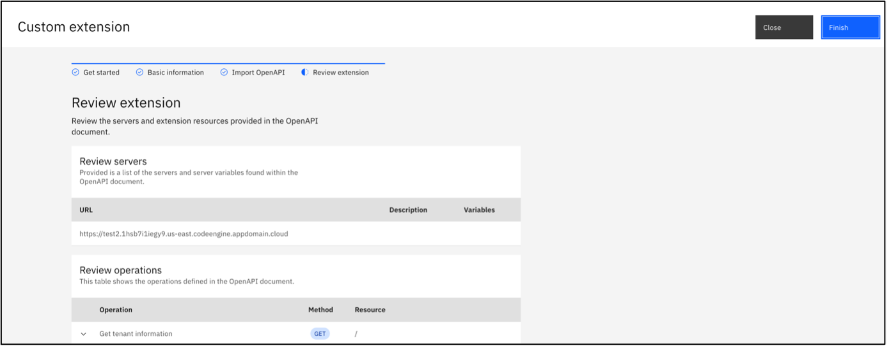

    11. Find your uploaded extension under the "Build Custom Extension" section.
    12. Click "Add", then click "Next

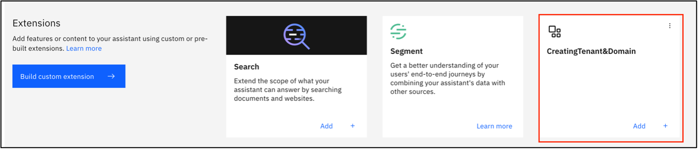 

    13. Keep the Authentication information as is and Click Next again.

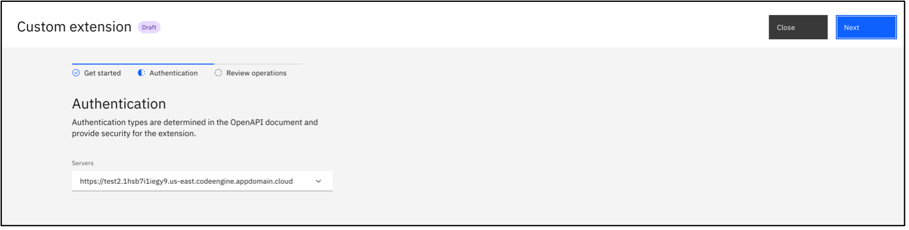 

    14. Click "Finish" to complete the import process.

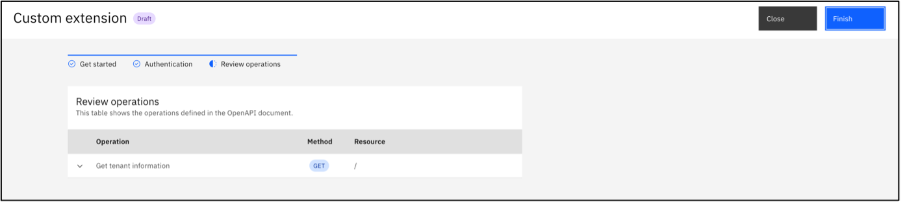 

    15. Repeat steps 1 through 12 for the second custom extension.

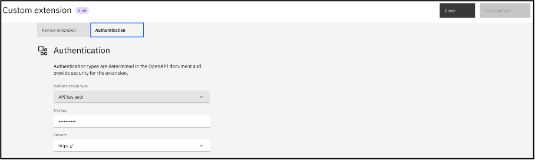 

## Importing Action Steps in Watsonx Assistant
    1. Go to the Action section within Watsonx Assistant.
    2. Click the Settings button located at the top right corner.

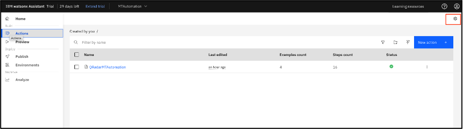

    3. Select "Upload/Download".
    4. Click on "Drag and drop file here" or "Click to select a file".

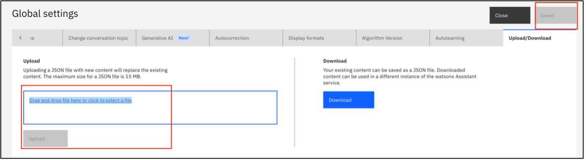

    5. Upload the action.json file.
    6. Click "Save" to complete the upload.
    

## Steps to deploy code on IBM Code Engine 

Step1: Login to ibm cloud from your terminal

Step2: Select the target group 
1. ibmcloud target -g `${target_group_name}`

Step3: Select the project created where you want to deploy the function 
1. ibmcloud ce project select -n `${project_name}`

Step4: Deploy the code-engine plugin in the terminal with the following command 
1. ibmcloud plugin install code-engine

Step5: To create the nodejs function in code engine
1. For nodejs 
    1. ibmcloud ce fn create --name `${function_name}` --runtime nodejs-18 --build-source .
2. For Python
    1. ibmcloud ce fn create --name `${function_name}` --runtime python-3.11 --build-source .

Step6: To update the same function
1. For nodejs
    1. ibmcloud ce fn update --name `${function_name}` --runtime nodejs-18 --build-source .
2. For Python
    1. ibmcloud ce fn update --name `${function_name}` --runtime python-3.11 --build-source .

